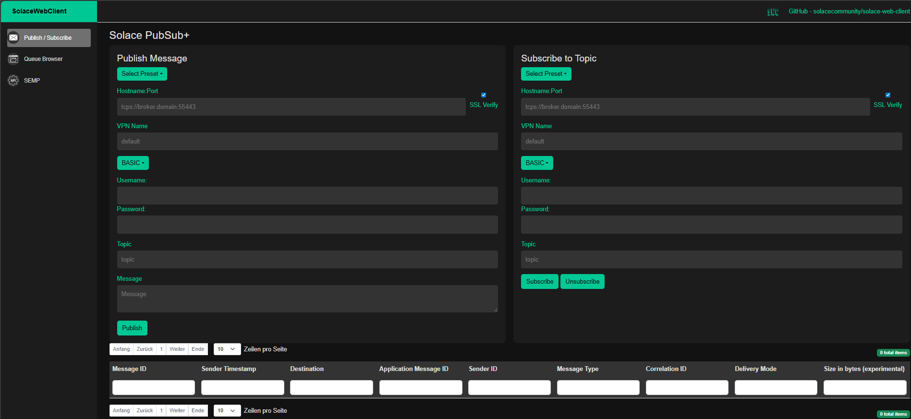
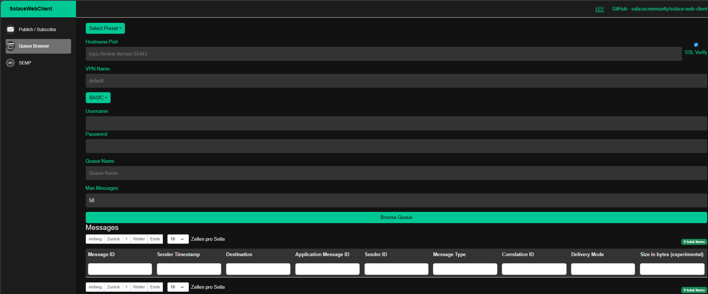
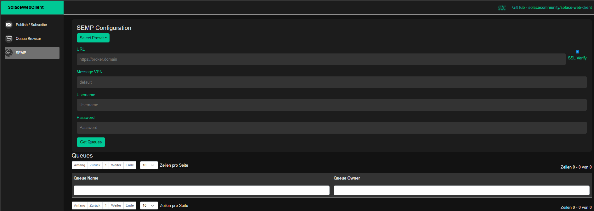

[](CODE_OF_CONDUCT.md)

# Solace Web Client

## Overview
The Solace Web Client is a .NET (C#) application that offers comprehensive functionalities for Queue Browsing, Publishing and Subscribing using the Solace PubSub+ platform.

## Features
- **Queue Browsing**: View and manage messages in your Solace queues. (Without SEMP access)
- **Publish & Subscribe**: Easily publish messages to topics and subscribe to them.
- **Authentication**: Supports authentication via username/password, OAuth2 or client certificate (mTLS).
- **Presets Management**: Load connection presets for quick access.
- **Secure Connections (TLS)**: Supports secure connections with certificate validation.
- **User-Friendly Interface**: Intuitive and easy-to-use web interface.

## Getting started quickly
To run the Solace Web Client using Docker, you can use the following commands:

#### Basic Run
```sh
docker run -d -p 8888:8080 solacecommunity/solace-web-client:latest
```

#### Optional mounts
```sh
- To validate secure connections (tcps://), mount the certificate(s) from your desired endpoint(s) in the /app/trustedca directory.
- To use presets,mount your presets.json into /app/presets/preset.json

docker run -d -p 8888:8080 -v $(pwd)/certs:/app/trustedca -v $(pwd)/presets.json:/app/presets/presets.json solacecommunity/solace-web-client:latest
```

Note: It is possible to disable SSL verification by unchecking "SSL Verify", though this is not recommended for production environments.


## Documentation
The project was created to provide an easy-to-use, GUI-based queue browser for Solace, enabling queue browsing and messaging without requiring access to the SEMP API. This allows users to manage and inspect queues securely and intuitively, even in environments where SEMP access is restricted.

## Screenshots

*Publish & Subscribe Interface*


*Queue Browser Interface*


*SEMP Interface*

## Resources
This is not an officially supported Solace product.

For more information try these resources:
- Ask the [Solace Community](https://solace.community)
- The Solace Developer Portal website at: https://solace.dev


## Contributing
Contributions are encouraged! Please read [CONTRIBUTING.md](CONTRIBUTING.md) for details on our code of conduct, and the process for submitting pull requests to us.

## Authors
See the list of [contributors](https://github.com/solacecommunity/solace-web-client/graphs/contributors) who participated in this project.

## License
See the [LICENSE](LICENSE) file for details.
